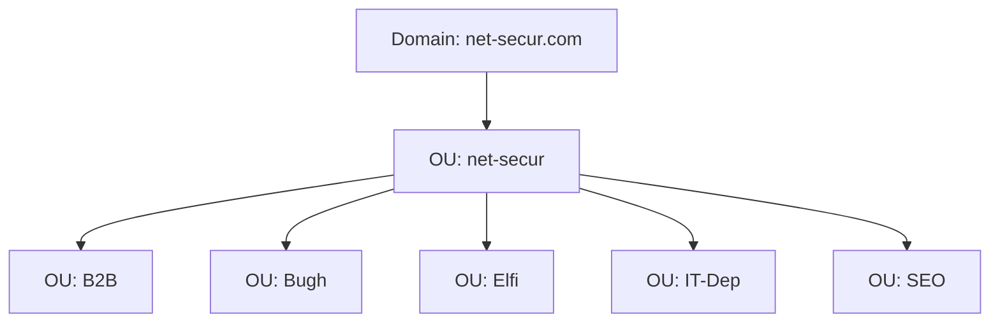

# Net-Secur Windows Server Lab

An evolving Windows Server and Active Directory lab created for the fictional **Net-Secur** IT outsourcing company.

The project demonstrates the deployment of a domain controller in a VMware virtual machine, the design of an organizational structure, and the administration of users and security groups. Future iterations will add client computers, Group Policy, shared resources, access control, auditing, and backup procedures.

> This repository documents a training environment. All user identities are fictional lab data based on public figures; no real credentials are stored here.

## Company scenario

| Item | Value |
|---|---|
| Company | Net-Secur |
| Domain | `net-secur.com` |
| Business area | Outsourced IT services |
| Core services | Network and server administration, technical support, and information security |
| Platform | Windows Server running in VMware |

## Current implementation

- Deployed Windows Server in a VMware virtual machine.
- Installed Active Directory Domain Services.
- Promoted the server to a domain controller.
- Created the `net-secur.com` Active Directory domain.
- Created the parent OU `net-secur`.
- Created five child OUs: `B2B`, `Bugh`, `Elfi`, `IT-Dep`, and `SEO`.
- Created disabled template accounts for repeatable user provisioning.
- Created departmental security groups.
- Added lab users to the appropriate groups.

## Active Directory structure

Each child OU currently contains:

- one disabled user template;
- four lab user accounts;
- one departmental security group.

## Evidence

### OU structure and group membership

Additional screenshots are available in [`docs/screenshots`](docs/screenshots).

## Security observations

The initial review identified two configuration checks for the next iteration:

1. Confirm that copied employee accounts are enabled after creation while template accounts remain disabled.
2. Remove template accounts from operational security groups because templates are provisioning objects, not active employees.

Passwords, recovery material, private keys, VM disks, and other secrets must never be committed to this repository.

## Documentation

- [Implementation notes](docs/implementation.md)
- [Security review](docs/security-review.md)
- [Project roadmap](docs/roadmap.md)
- [Changelog](CHANGELOG.md)

## Roadmap

- [x] Deploy the Windows Server virtual machine.
- [x] Configure Active Directory and promote the server to a domain controller.
- [x] Create OUs, user templates, user accounts, and security groups.
- [ ] Review account and group membership configuration.
- [ ] Join a Windows client to the domain.
- [ ] Configure Group Policy Objects.
- [ ] Create shared folders and apply NTFS/share permissions.
- [ ] Implement administrative role separation.
- [ ] Configure auditing, backup, and recovery tests.
- [ ] Add PowerShell automation and validation scripts.

## Repository policy

This repository stores documentation, screenshots, and safe automation scripts only. VMware disk images and configuration files are intentionally excluded because they may be large or contain environment-specific and sensitive data.
