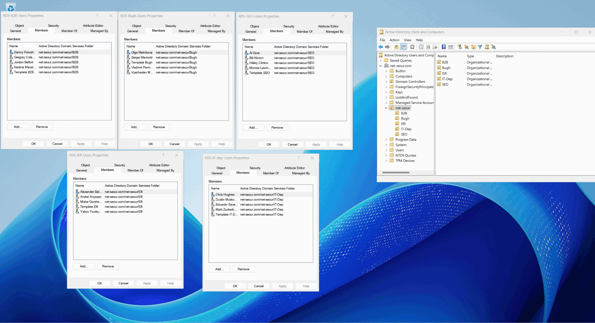

# Net-Secur Windows Server Lab

An evolving Windows Server, Active Directory, and Group Policy lab created for the fictional **Net-Secur** IT outsourcing company.

The project demonstrates deployment of a domain controller and Windows client in VMware, design of an organizational structure, administration of users and security groups, and staged security hardening through centrally managed Group Policy Objects.

> This repository documents a training environment. All user identities are fictional lab data based on public figures; no real credentials are stored here.

## Company scenario

| Item | Value |
|---|---|
| Company | Net-Secur |
| Domain | `net-secur.com` |
| Domain controller | `DC-1.net-secur.com` |
| Server platform | Windows Server 2022 |
| Client platform | Windows 11 |
| Hypervisor | VMware |
| Business area | Outsourced IT services |

## Current implementation

- Deployed Windows Server 2022 and Windows 11 virtual machines in VMware.
- Installed Active Directory Domain Services and promoted `DC-1` to a domain controller.
- Created the `net-secur.com` domain and the parent OU `net-secur`.
- Created five child OUs: `B2B`, `Bugh`, `Elfi`, `IT-Dep`, and `SEO`.
- Created disabled user templates, lab users, and departmental security groups.
- Joined `PC-1-WIN11` to the domain and moved its computer object to `OU=IT-Dep`.
- Backed up the existing Group Policy Objects before security changes.
- Created `Global_Security_Baseline` and linked it to all five departmental OUs.
- Added separate departmental GPOs for role-specific restrictions and logging.
- Configured the initial removable-media, Microsoft Defender, UAC, and Advanced Audit Policy settings.
- Corrected the removable-storage, Defender, and PowerShell logging settings identified during the screenshot review and captured final GPO-editor evidence.
- Kept the `Domain Controllers` OU and domain root outside the pilot baseline scope.

## Active Directory structure

| Parent distinguished name | Child OU | Security group | Department GPO |
|---|---|---|---|
| `OU=net-secur,DC=net-secur,DC=com` | `B2B` | `RDS-B2B-Users` | `40--B2B-Security` |
| `OU=net-secur,DC=net-secur,DC=com` | `Bugh` | `RDS-Bugh-Users` | `40-Bugh-Security` |
| `OU=net-secur,DC=net-secur,DC=com` | `Elfi` | `RDS-Elfi-Users` | `40--Elfi-Security` |
| `OU=net-secur,DC=net-secur,DC=com` | `IT-Dep` | `RDS-IT-dep-Users` | `40--ITdep-Security` |
| `OU=net-secur,DC=net-secur,DC=com` | `SEO` | `RDS-SEO-Users` | `40--SEO-Security` |

## Group Policy architecture

Every departmental OU receives the common `Global_Security_Baseline`. Its local departmental GPO has higher link priority and is not enforced, so department-specific settings can be managed without copying the entire baseline.

| Scope | Key controls |
|---|---|
| All five department OUs | Defender protection, removable-media execution blocking, AutoRun/AutoPlay protection, UAC secure desktop, and security auditing |
| B2B | RDP disabled; 5-minute inactivity limit |
| Bugh | Controlled Folder Access in Audit Mode; RDP disabled; 5-minute inactivity limit |
| Elfi | PowerShell Script Block and Module Logging |
| IT-Dep | RDP Network Level Authentication, password prompt, and PowerShell logging |
| SEO | Defender Network Protection in Block mode; RDP disabled; 5-minute inactivity limit |

See [GPO security baseline and deployment](docs/gpo-security-baseline.md) for the exact settings, scope, limitations, and validation procedure.

The table above describes the target design. The initial screenshots captured several unsafe or incomplete settings; the later `GBS-1` through `GBS-10` evidence set confirms their correction in the GPO editor. Effective application on a client remains a separate validation step.

## Evidence

### OU structure and group membership

Additional screenshots are available in [`docs/screenshots`](docs/screenshots).

The GPO rollout evidence is catalogued and reviewed in [`net-secur_com_GPO`](net-secur_com_GPO). The index distinguishes the original intermediate screenshots from the final correction evidence.

## Security status

The target GPO design is intended to reduce malware execution from removable storage, disable automatic content execution, strengthen Defender and UAC behavior, and record security-relevant activity.

The uploaded screenshots confirm UAC secure-desktop settings, selected audit categories, Bugh Controlled Folder Access in Audit Mode, department RDP controls, IT-Dep NLA/password prompting, PowerShell logging, SEO Network Protection, removable-disk execution denial, and corrected Defender policies. The final GPO-editor state is documented, but effective application still requires `gpresult`, RSoP, USB execution testing, and Defender-status evidence from a client.

BitLocker To Go and a USB device allowlist remain deliberately deferred. The lab must first establish corporate-media ownership, recovery-key handling, and an approved hardware inventory; premature enforcement could block legitimate devices or cause loss of access to data.

The remaining identity findings from the initial review still require validation: copied employee account state, template membership in operational groups, and privileged-account separation.

Passwords, recovery material, private keys, VM disks, and other secrets must never be committed to this repository.

## Documentation

- [Implementation notes](docs/implementation.md)
- [GPO security baseline and deployment](docs/gpo-security-baseline.md)
- [Security review](docs/security-review.md)
- [Project roadmap](docs/roadmap.md)
- [Changelog](CHANGELOG.md)

## Roadmap

- [x] Deploy the Windows Server and Windows 11 virtual machines.
- [x] Configure Active Directory and promote the server to a domain controller.
- [x] Create OUs, user templates, user accounts, and security groups.
- [x] Join `PC-1-WIN11` to the domain and place it in `IT-Dep`.
- [x] Back up existing GPOs and deploy the common security baseline.
- [x] Create and link departmental security GPOs.
- [x] Configure endpoint auditing and review the captured settings.
- [x] Correct and document the removable-media, Defender, PowerShell logging, and IT-Dep link states identified in the screenshot review.
- [ ] Validate effective policy with `gpresult`, RSoP, and Event Viewer.
- [ ] Review account and group membership configuration.
- [ ] Create shared folders and apply NTFS/share permissions.
- [ ] Implement administrative role separation and Windows LAPS.
- [ ] Add centralized event collection and tested recovery procedures.
- [ ] Add PowerShell automation and validation scripts.

## Repository policy

This repository stores documentation, screenshots, and safe automation scripts only. VMware disk images and configuration files are intentionally excluded because they may be large or contain environment-specific and sensitive data. Exported GPO backups must be reviewed for scripts, paths, and other environment-specific information before publication.
